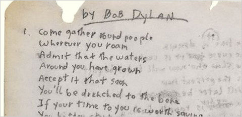

Project 1: A "data story" on the songs of our times



### [Project Description](doc/)


+ Projec title: Songs by genres
+ This project is conducted by Jongyoon Sohn


Have it happened to you when a song was really *speaking* to you? Do you like some of your favorite songs for their lyrics? When you think of a particular music genre (e.g., classic rock), do you expect certain *topics* or *sentiments* for the lyrics?

The goal of this project is to look deeper into the patterns and characteristics of different types of song lyrics. Applying tools from natural language processing and text mining, students should derive interesting findings in this collection of song lyrics and write a "data story" that can be shared with a general audience.

### Datasets

+ "lyrics.csv" ([Download](https://www.dropbox.com/s/3tfv5v73z0ec8vr/lyrics.csv?dl=0)) is a filtered corpus of 100,000+ song lyrics from MetroLyrics. Available features are song name, year, artist, genre, and lyrics. You can find the complete 380,000+ song lyrics data on [Kaggle](https://www.kaggle.com/gyani95/380000-lyrics-from-metrolyrics). A ```lyrics.RData``` file is also provided in the [\data folder](../data/).

+ "artists.csv" (in the [\data folder](../data/)) provides additional background information of all the artistis. These information were scraped from [LyricsFreak](https://www.lyricsfreak.com/) by the ADS instructional team. For the singers, a detailed biography is provided. And for the bands, available information are members, established year and location. **The use of this data set for this project is optional.**

### Challenge

In this project you will carry out an **exploratory data analysis (EDA)** of the corpus of song lyrics and write a blog on interesting findings from the provide data sets (i.e., a *data story*).

My task is to explore the texts using tools from text mining and natural language processing such as sentiment analysis, topic modeling, etc, all available in `R` and write a blog post using `R` Notebook. Your blog should be in the form of a `data story` blog on interesting trends and patterns identified by your analysis of these song lyrics.

Even though this is an individual project, you are **encouraged** to discuss with your classmates online and exchange ideas.


+ Project summary: This project demonstrates that different music genres have various characteristics in terms of words counts, words usage, etc. Details are discussed in the doc folder. Required libraries can be found in the README.md in the doc folder.

Following [suggestions](http://nicercode.github.io/blog/2013-04-05-projects/) by [RICH FITZJOHN](http://nicercode.github.io/about/#Team) (@richfitz). This folder is orgarnized as follows.

```
proj/
├── lib/
├── data/
├── doc/
├── figs/
└── output/
```

Please see each subfolder for a README file.
